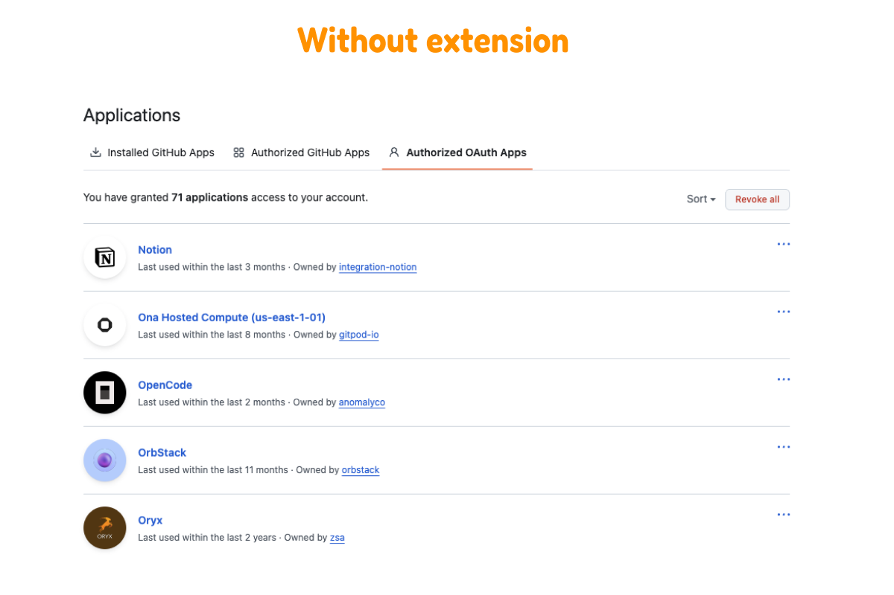
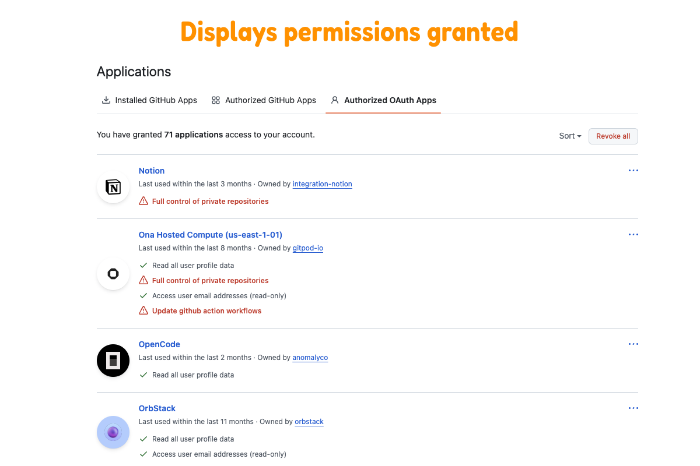
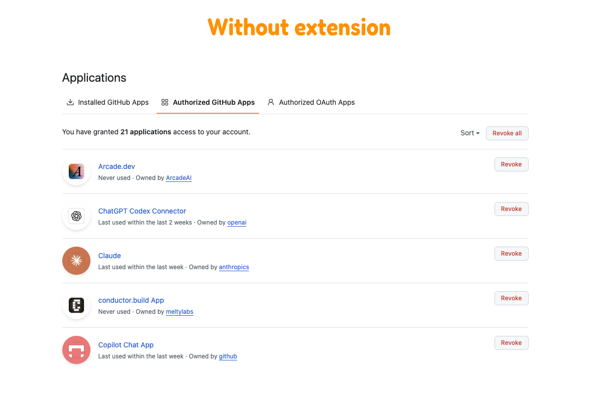
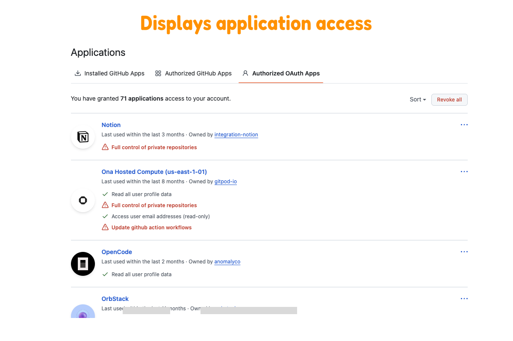

# GitHub Authorized Apps - Inline Permissions

A tiny Chrome/Arc extension that augments **Settings → Applications** so authorized
OAuth apps and authorized GitHub apps show their **permissions inline**.

It is **read-only**: it fetches each app's own detail page using your logged-in session and
displays the permissions. It never revokes or changes anything.

## Screenshots

<details>
<summary>Authorized OAuth Apps</summary>

_URL: [https://github.com/settings/applications](https://github.com/settings/applications)_

### GitHub page



### With inline permissions



</details>

<details>
<summary>Authorized GitHub Apps</summary>

_URL: [https://github.com/settings/apps/authorizations](https://github.com/settings/apps/authorizations)_



### With inline permissions



</details>

## Install (Load unpacked)

1. Open your browser's extensions page:
   - Chrome: `chrome://extensions`
   - Arc: `arc://extensions` (or Chrome menu → Extensions)
2. Turn on **Developer mode** (top-right toggle).
3. Click **Load unpacked** and select this folder
   (`github-authorized-apps-inline-permissions`, the one containing `manifest.json`).
4. Go to <https://github.com/settings/applications> or
   <https://github.com/settings/apps/authorizations> and reload.
   Each app row will show its permissions beneath the "Owned by …" line.

## Enable or disable

Click the extension icon and use **Show permissions** to turn the inline permissions
lists on or off without disabling the whole extension.

## What the markers mean

- `<permission>` - a granted permission shown with GitHub's check icon.
- Red warning rows - permissions that can expose private repositories, org/team data,
  workflows, admin/delete abilities, keys, packages, webhooks, or tokens.

## Notes & tuning

- Results are cached per browser session, so paginating back and forth is fast.
- GitHub occasionally changes the markup of the app detail page. If a row shows
  *"Could not load permissions"* or the text looks like navigation junk, the permissions
  parser (`parsePermissions` in `content.js`) likely needs a selector tweak.
- Works in any Chromium browser (Chrome, Arc, Edge, Brave).

## Development

```sh
npm test
npm run check
npm run package
```

The release ZIP is written to `dist/`.

## Privacy

See [PRIVACY.md](PRIVACY.md).

## Contributing

See [CONTRIBUTING.md](CONTRIBUTING.md).

## License

MIT. See [LICENSE](LICENSE).
